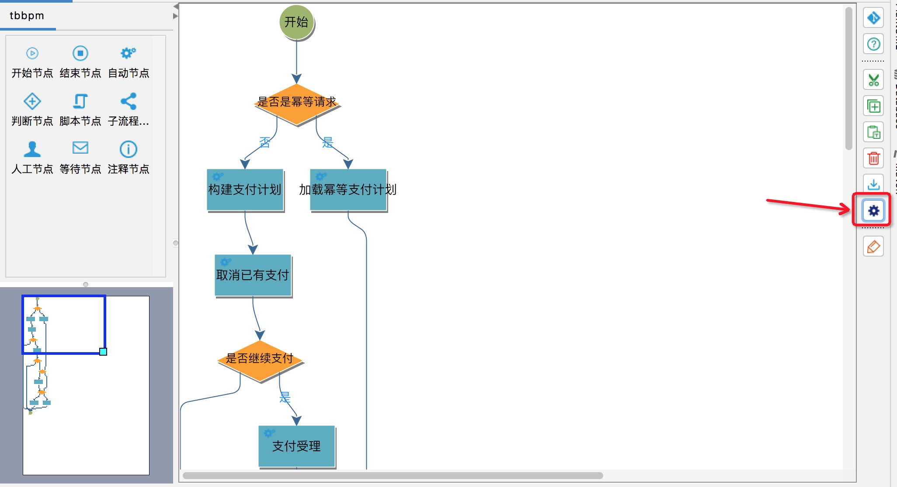

# 历史版本下载

## 1.0.13
* 升级说明：优化了一些内部逻辑
* idea是2018以上且2020版本以下的请下载：[compileflow-idea-designer-1.0.13.for2018up.zip](idea-designer/compileflow-idea-designer-1.0.13.for2018up.zip)
* idea是2020版本上的请下载：[compileflow-idea-designer-1.0.13.for2020up.zip](idea-designer/compileflow-idea-designer-1.0.13.for2020up.zip)

## 1.0.12
* 升级说明：常规性bug修复
* idea是2018以上且2020版本以下的请下载：[compileflow-idea-designer-1.0.12.for2018up.zip](idea-designer/compileflow-idea-designer-1.0.12.for2018up.zip)
* idea是2020版本上的请下载：[compileflow-idea-designer-1.0.12.for2020up.zip](idea-designer/compileflow-idea-designer-1.0.12.for2020up.zip)

## 1.0.11
* 升级说明：支持布局切换
* idea是2018以上且2020版本以下的请下载：[compileflow-idea-designer-1.0.11.for2018up.zip](idea-designer/compileflow-idea-designer-1.0.11.for2018up.zip)
* idea是2020版本上的请下载：[compileflow-idea-designer-1.0.11.for2020up.zip](idea-designer/compileflow-idea-designer-1.0.11.for2020up.zip)
* 操作示例：
点击设置操作项

点击弹出设置，可设置样式，和布局（设置布局后，需要重新关闭文件再打开才会生效，布局的选择可以有效的解决，因为节点多很多线重叠显示不友好的场景，可以选择一个适合自己的布局显示）

## 1.0.10
* 升级说明：支持2021.2版本安装
* idea是2018以上且2020版本以下的请下载：[compileflow-idea-designer-1.0.10.for2018up.zip](idea-designer/compileflow-idea-designer-1.0.10.for2018up.zip)
* idea是2020版本上的请下载：[compileflow-idea-designer-1.0.10.for2020up.zip](idea-designer/compileflow-idea-designer-1.0.10.for2020up.zip)

## 1.0.9
* 升级说明：支持等待节点、优化javacode展示
* idea是2018以上且2020版本以下的请下载：[compileflow-idea-designer-1.0.9.for2018up.zip](idea-designer/compileflow-idea-designer-1.0.9.for2018up.zip)
* idea是2020版本上的请下载：[compileflow-idea-designer-1.0.9.for2020up.zip](idea-designer/compileflow-idea-designer-1.0.9.for2020up.zip)

## 1.0.8
* 升级说明：支持2021.1版本（2020版本以下的如果1.0.8版本安装有问题，可以回退安装1.0.7。 1.0.8没有做功能上的升级，只是兼容了2021.1版本的安装）
* idea是2020版本以下的请下载：[compileflow-idea-designer-1.0.8.zip](idea-designer/compileflow-idea-designer-1.0.8.zip)
* idea是2020版本及以上的请下载：[compileflow-idea-designer-1.0.8.for.2020.up.zip](idea-designer/compileflow-idea-designer-1.0.8.for.2020.up.zip)
* idea是2021.1版本及以上的请下载：[compileflow-idea-designer-1.0.8.for.2021.1.up.zip](idea-designer/compileflow-idea-designer-1.0.8.for.2021.1.up.zip)

## 1.0.7
* 升级说明：支持2020.3版本
* idea是2020版本以下的请下载：[compileflow-idea-designer-1.0.7.zip](idea-designer/compileflow-idea-designer-1.0.7.zip)
* idea是2020版本及以上的请下载：[compileflow-idea-designer-1.0.7.for.2020.up.zip](idea-designer/compileflow-idea-designer-1.0.7.for.2020.up.zip)

## 1.0.6
* 升级说明：支持循环节点中的continue节点和break节点
* idea是2020版本以下的请下载：[compileflow-idea-designer-1.0.6.zip](idea-designer/compileflow-idea-designer-1.0.6.zip)
* idea是2020版本及以上的请下载：[compileflow-idea-designer-1.0.6.for.2020.up.zip](idea-designer/compileflow-idea-designer-1.0.6.for.2020.up.zip)

## 1.0.5
* 升级说明：支持循环节点中的continue节点和break节点
* idea是2020版本以下的请下载：[compileflow-idea-designer-1.0.5.zip](idea-designer/compileflow-idea-designer-1.0.5.zip)
* idea是2020版本及以上的请下载：[compileflow-idea-designer-1.0.5.for.2020.up.zip](idea-designer/compileflow-idea-designer-1.0.5.for.2020.up.zip)